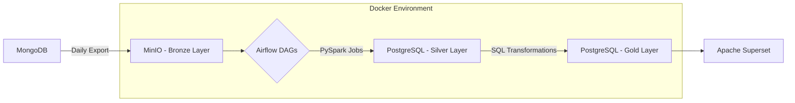

# 💸 Hisaab Analytics - WIP

-blue>)


## 🧠 Friendships. Tracked. Transformed. Monetized?

**Hisaab** is what happens when five friends try to split bills... and one of them turns it into a data engineering project.

What started as a expense tracker web app — built to prevent “bro tu kal ka de de” situations — is now a robust pipeline featuring orchestration, transformation, warehouse modeling, observability, and more. Powered by **MongoDB**, **MinIO**, **Airflow**, **PySpark**, **PostgreSQL**, and **Apache Superset** this system transforms raw chaos into golden insights — all following the **medallion architecture** (bronze → silver → gold).

> Yes, the data is real.
> No, I’m not selling my friends’ data.
> But if I was, this README would be the pitch deck.

### Why I Built This
While everyone builds e-commerce pipelines with fake orders and dummy payments, I wanted something real. Data that’s messy, personal, and weirdly emotional. So I turned to the one source of truth I had — our daily, chaotic expense records.
Hisaab became a fun yet serious playground for:
- Learning & getting hands dirty with Docker.
- Practising medallion architecture in PySpark.
- Trying out databases other than Snowflake.
- Building reusable and parameterized Airflow DAGs.
- Getting some elbow grease with MinIO.
- Visualizing behavioral patterns with Apache Superset.

---

## 🚀 Project Highlights

- 📅 **Real-world data**: Ingests and transforms 6+ months of collaborative expense data from 4+ users.
- 🔁 **End-to-end orchestration**: Airflow DAGs manage ingestion, validation, transformation, and analytics.
- 🏗️ **Medallion Architecture**: Follows a structured bronze-silver-gold layering strategy for scalability and clarity.
- 🐳 **Production-ready deployment**: Fully dockerized with custom health checks, resource limits, and service monitoring.
- 📈 **Analytical depth**: Answers 10+ business questions related to user behavior, spending habits, and system quality.

---

## 🛠️ Tech Stack Overview

| Component         | Technology                          | Role                                |
| ----------------- | ----------------------------------- | ----------------------------------- |
| **Orchestration** | Apache Airflow 2.10.0               | Workflow scheduling & observability |
| **Processing**    | PySpark 3.3 (4-core local cluster)  | Distributed data transformations    |
| **Raw Storage**   | MinIO                               | Object storage for raw MongoDB data |
| **Database**      | PostgreSQL 13                       | Silver & gold model storage         |
| **Admin UI**      | pgAdmin                             | PostgreSQL GUI client               |
| **Deployment**    | Docker Compose                      | Containerized, isolated environment |
| **Dashboards**    | Apache Superset                     | Visual analytics and insights       |

---

## 📊 Data Architecture Diagram



---

## 🧱 Directory Structure

```
.
├── dags/                          # Airflow DAG definitions
│   ├── 01_mongo_to_minio.py       # Data ingestion pipeline
│   ├── 02_bronze_processing.py    # Raw data validation & structuring
│   ├── 03_ddl_deployment.py       # Schema creation in PostgreSQL
│   ├── 04_silver_gold.py          # Core transformations
│   └── utils/                     # utility function folder
├── sql_scripts/
│   ├── bronze/                    # Mongo-style schemas
│   ├── silver/                    # Cleaned business entities
│   └── gold/                      # Analytical aggregations
├── spark_scripts/
│   ├── bronze/                    # Initial validation/cleaning
│   ├── silver/                    # Business rule applications
│   └── gold/                      # Summary-level aggregations
├── data/                          # Mounted volume storage
├── docker-compose.yml            # Multi-container deployment config
└── Dockerfile.airflow            # Custom Apache Airflow image
```

---

## 🔍 Analytical Insights

### 👥 User Behavior

- Monthly active users & retention trends
- Most active days & times for expense logging
- Role-based behavior: Admins vs. Regular Users

### 💸 Expense Patterns

- Monthly spending trends & spikes
- Frequently purchased items (by category & user)
- Inter-user debt tracking & reimbursement cycles

### 🧪 Data Quality Checks

- Invalid user references
- Timestamp consistency
- Change-tracking for modified records

---

## 🧩 Pipeline Components

### 1. Bronze Layer (Raw Ingestion)

- Source: MongoDB collections exported daily
- Stored in MinIO as timestamped, JSON-like objects
- Preserves full schema and original structure

### 2. Silver Layer (Structured Cleansing)

- PySpark validates and parses raw records
- Resolves foreign keys (user references)
- Applies type enforcement & categorical labeling

### 3. Gold Layer (Business Analytics)

- Aggregates and joins multiple silver models
- Produces final reporting tables:

  - Spending per user per month
  - Debt relationships
  - Logging activity trends

---

## ⚙️ Getting Started

### ✅ Prerequisites

- Docker 20.10+
- Docker Compose v2.0+
- 4GB+ RAM (8GB recommended)

### 📥 Installation

```bash
git clone https://github.com/asdhamidi/hisaab-analytics.git
cd hisaab-analytics
docker-compose up -d
```

Wait \~3–5 minutes for all services to initialize:
### 🌐 Service Endpoints

| Service  | URL                                            | Credentials                 |
| -------- | ---------------------------------------------- | --------------------------- |
| Airflow  | [http://localhost:8080](http://localhost:8080) | `airflow` / `airflow`       |
| pgAdmin  | [http://localhost:5050](http://localhost:5050) | From `.env` file            |
| MinIO    | [http://localhost:9001](http://localhost:9001) | `minioadmin` / `minioadmin` |
| Spark UI | [http://localhost:8081](http://localhost:8081) | -                           |

---

## 🛤️ Roadmap

- [ ] Build Apache Superset dashboard for gold-layer insights
- [ ] Add PySpark unit tests (via `pytest`)
- [ ] Integrate Great Expectations or custom DQ alerts
- [ ] Automate CI/CD pipeline (GitHub Actions)
- [ ] Publish data dictionary & schema documentation
- [ ] Deploy this entire thing to the cloud

---

## 🤝 Contributing

This is a **personal portfolio project** designed to demonstrate real-world data engineering skills.
Open to feedback, suggestions, and collaboration ideas — especially if you're good at settling group expenses 😅

---

## 📜 License

This project is licensed under the [MIT License](./LICENSE).

---

## 💼 Why This Project Matters

> This project highlights a complete journey from **raw operational data** to **structured analytical insight** using robust, scalable tooling. It's built not just to run — but to **last**. Whether you're a recruiter, engineer, or data enthusiast, this pipeline demonstrates production-grade thinking with end-to-end traceability.
